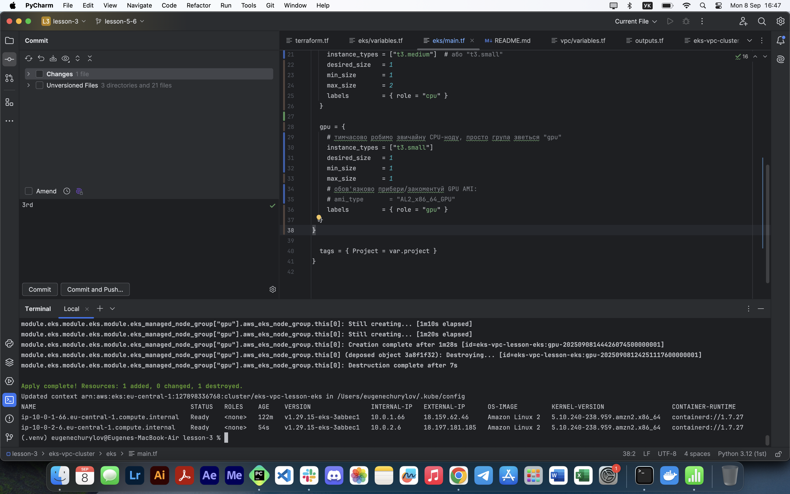

## 📌 Опис
У цьому проєкті ми:
- Створили **VPC** за допомогою модуля [terraform-aws-modules/vpc/aws](https://registry.terraform.io/modules/terraform-aws-modules/vpc/aws/latest)
- Розгорнули **EKS кластер** за допомогою [terraform-aws-modules/eks/aws](https://registry.terraform.io/modules/terraform-aws-modules/eks/aws/latest)
- Налаштували **node groups**:
  - `cpu` — на базі t3.medium
  - (опціонально) `gpu` — для ML-задач
- Забезпечили доступ через `kubectl` одразу після `terraform apply`

---

## 🚀 Як запустити

### 1. Ініціалізація
```bash
terraform -chdir=eks-vpc-cluster init -upgrade
terraform -chdir=eks-vpc-cluster validate
terraform -chdir=eks-vpc-cluster plan
terraform -chdir=eks-vpc-cluster apply
```

### 2. Підключення до кластеру
```bash
aws eks --region eu-central-1 --profile default update-kubeconfig --name eks-vpc-lesson-eks
kubectl get nodes -o wide
```

### 3. Перевірка (скріншот)


### 4. Зупинка інфраструктури (щоб уникнути зайвих витрат)
```bash
terraform -chdir=eks-vpc-cluster destroy -auto-approve
```
