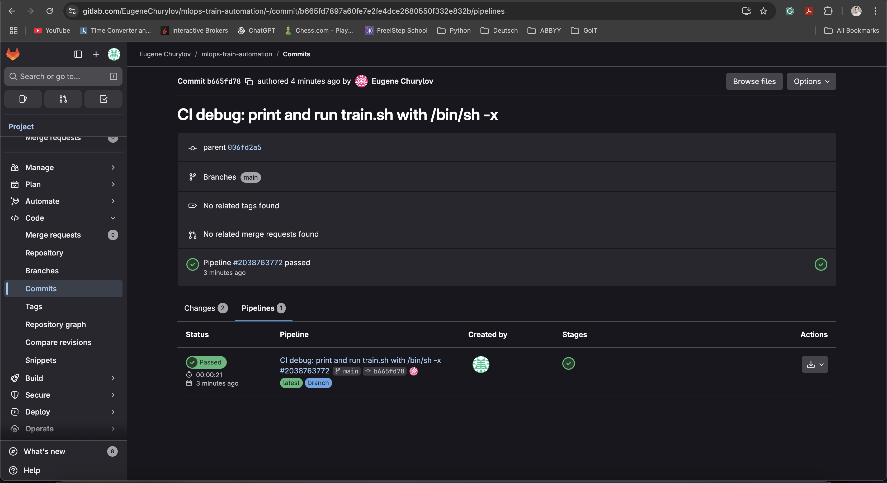
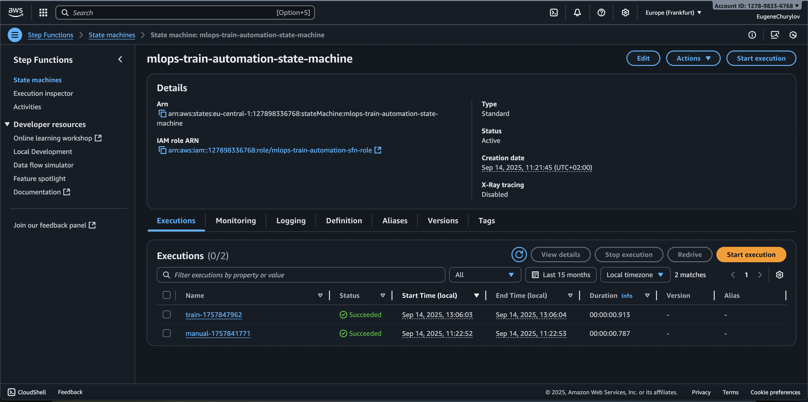
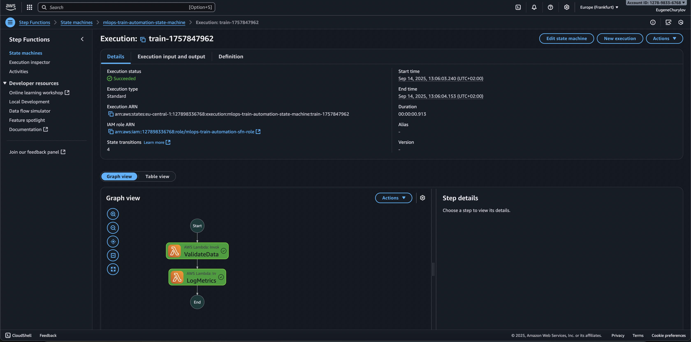
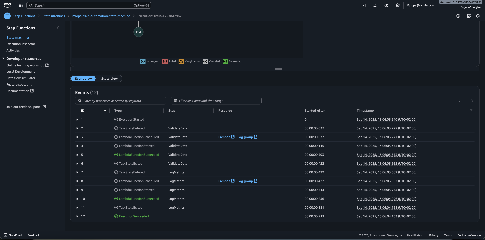

# MLOps Train Automation

Цей проєкт демонструє автоматизацію процесу тренування моделей за допомогою **AWS Step Functions**, **AWS Lambda**, **Terraform** та **GitLab CI**.

---

## 📂 Структура проєкту

```
mlops-train-automation/
├── terraform/
│   ├── main.tf
│   ├── variables.tf
│   └── lambda/
│       ├── validate.py
│       ├── log_metrics.py
│       ├── validate.zip
│       └── log_metrics.zip
├── .gitlab-ci.yml
├── README.md
```

---

## 🐍 Lambda-функції

У папці `terraform/lambda/` є дві функції:

- **validate.py** – умовна валідація даних (`print("Validating data...")`)
- **log_metrics.py** – умовний лог метрик (`print("Logging metrics...")`)

### Збірка архівів
```bash
cd terraform/lambda
zip validate.zip validate.py
zip log_metrics.zip log_metrics.py
```

---

## ☁️ Розгортання інфраструктури через Terraform

1. Перейти у директорію:
   ```bash
   cd terraform
   ```
2. Ініціалізувати Terraform:
   ```bash
   terraform init
   ```
3. Застосувати конфігурацію:
   ```bash
   terraform apply -auto-approve
   ```
4. Отримати ARN state machine:
   ```bash
   terraform output state_machine_arn
   ```

---

## ▶️ Ручний запуск Step Function

```bash
SFN_ARN="<ARN_З_TERRAFORM_OUTPUT>"

aws stepfunctions start-execution   --region eu-central-1   --state-machine-arn "$SFN_ARN"   --name "manual-$(date +%s)"   --input '{"source":"manual","commit":"local-test"}'
```

---

## 🤖 GitLab CI

Файл `.gitlab-ci.yml` містить job `train-model`, який автоматично запускає Step Function при кожному push у `main`.

### Приклад job:
```yaml
train-model:
  stage: train
  image: amazon/aws-cli:2.15.0
  script:
    - aws stepfunctions start-execution         --region "$AWS_DEFAULT_REGION"         --state-machine-arn "$SFN_ARN"         --name "train-$(date +%s)"         --input "{\"source\":\"gitlab-ci\",\"commit\":\"$CI_COMMIT_SHORT_SHA\"}"
```

### Необхідні змінні в GitLab CI/CD Settings:
- `AWS_ACCESS_KEY_ID`
- `AWS_SECRET_ACCESS_KEY`
- `AWS_DEFAULT_REGION=eu-central-1`
- `SFN_ARN=<ARN state machine з Terraform>`

---

## 📦 Приклад JSON, який передається в Step Function

Через GitLab CI до state machine передається JSON:

```json
{
  "source": "gitlab-ci",
  "commit": "a1b2c3d4"
}
```

- `source` — завжди `"gitlab-ci"`
- `commit` — короткий SHA коміту (`$CI_COMMIT_SHORT_SHA`)

---

## 🔍 Перевірка

1. В AWS Console → Step Functions → обрати state machine → перевірити вкладку **Executions**.  
2. Там видно Input (JSON) і статус виконання.  
3. Логи обох Lambda доступні у **CloudWatch Logs**.

---

## Screenshots

### GitLab Pipeline


### AWS Step Function


### AWS Step Function – Graph view


### AWS Step Function – Event view


✅ Таким чином:  
- Є Step Function з двома кроками (ValidateData → LogMetrics).  
- Lambda-функції і zip-архіви у `terraform/lambda`.  
- Terraform описує IAM ролі, Lambda і Step Function.  
- GitLab CI викликає state machine через AWS CLI.  
- README містить всі інструкції і приклад JSON.  
