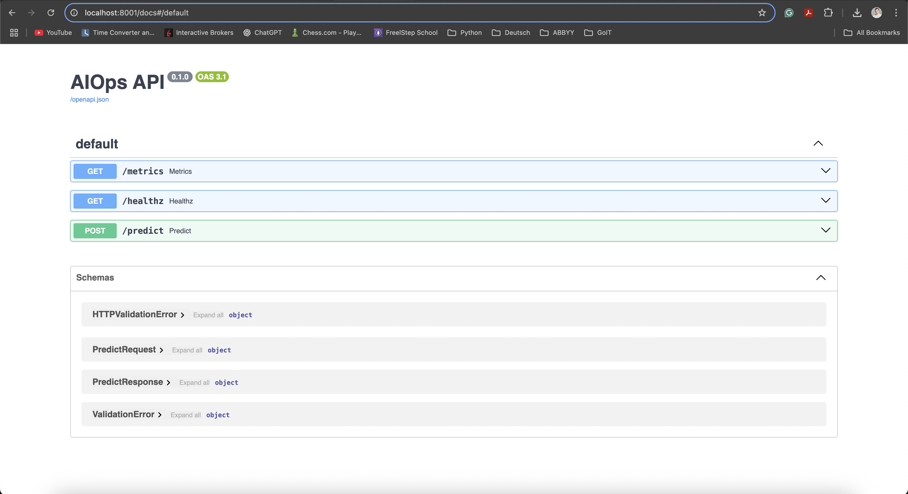
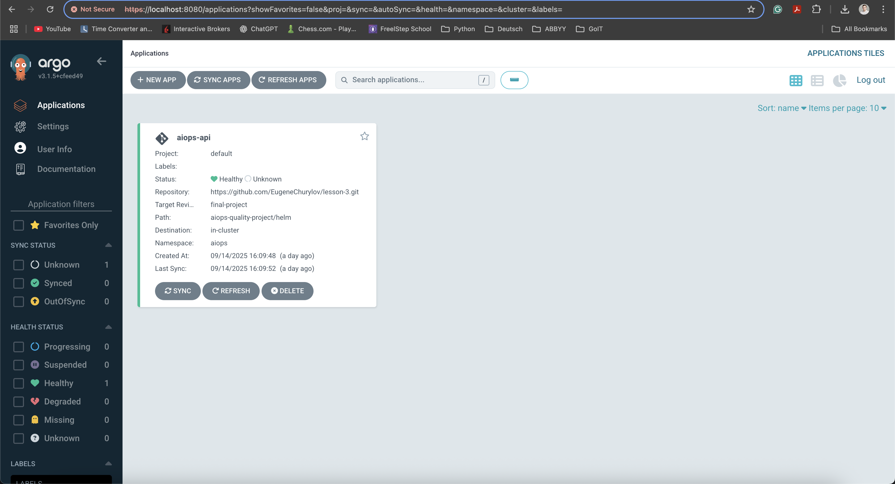
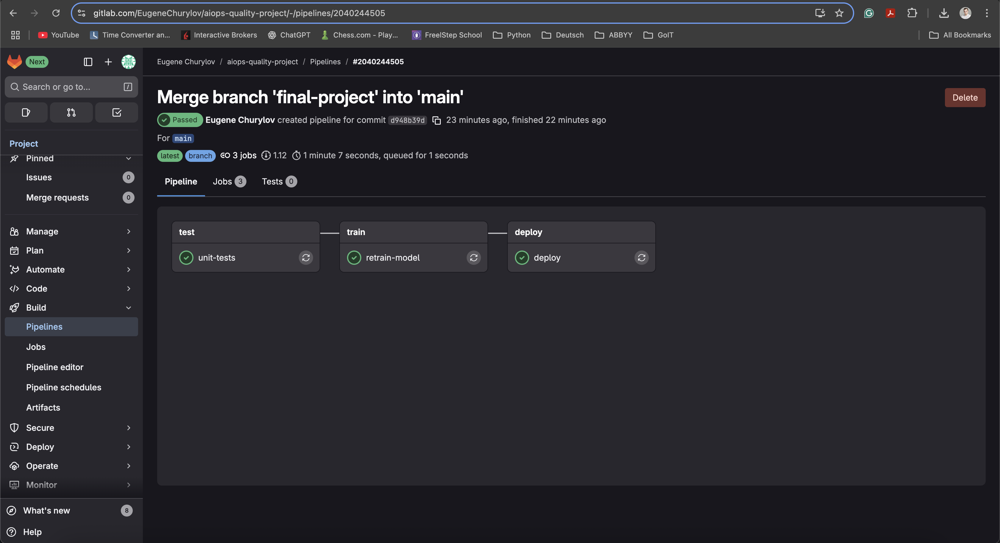
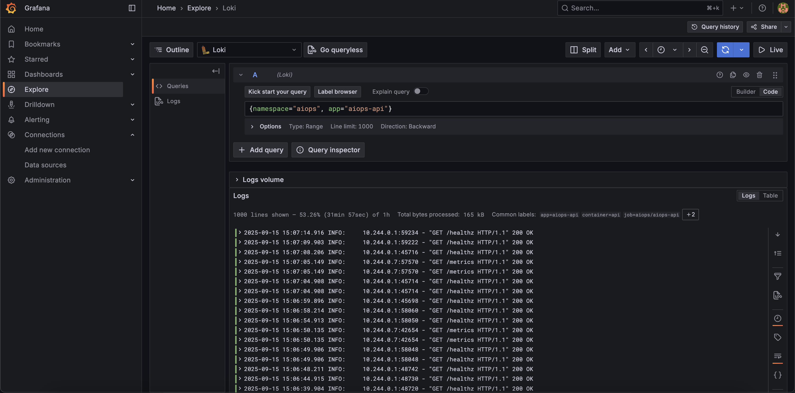
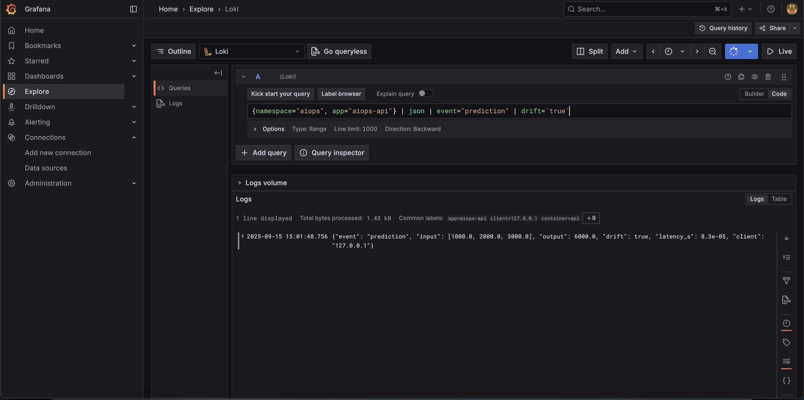
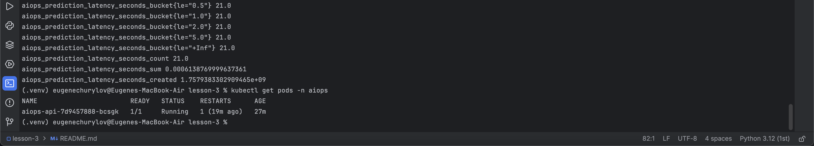
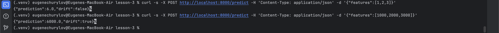
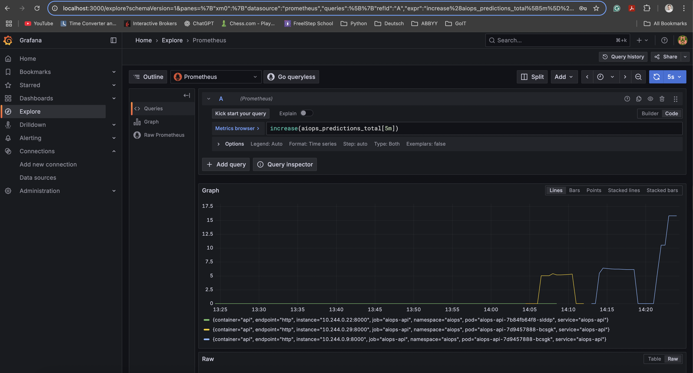
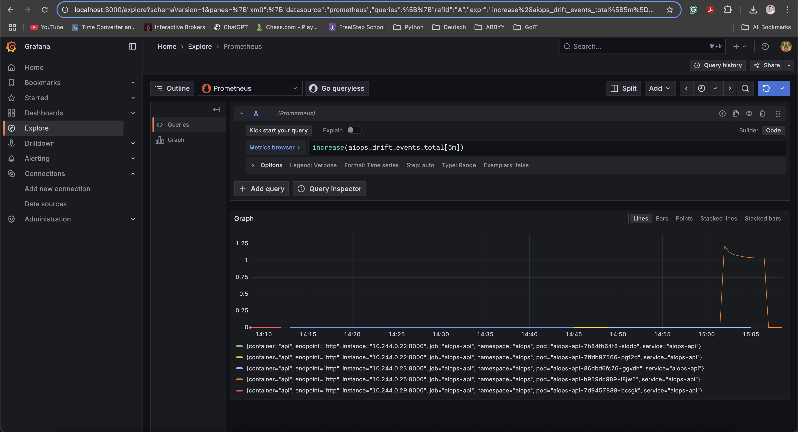
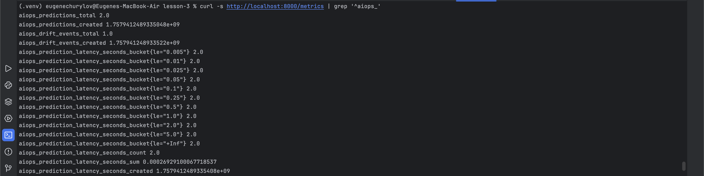

# AIOps Quality Project

## Опис
У цьому завданні реалізовано повний пайплайн для FastAPI‑сервісу з логуванням у Loki, моніторингом у Grafana/Prometheus та дрейф‑детектором. Також налаштовано GitLab CI для автоматичного retrain.

---

## Архітектура
- **FastAPI** — REST API `/predict` з логуванням у stdout.
- **Loki + Promtail** — збирають логи та дозволяють шукати події у Grafana Explore.
- **Prometheus** — збирає метрики сервісу (кількість запитів, latency, drift events).
- **Grafana** — візуалізація логів та метрик.
- **ArgoCD** — деплой Helm‑чарту з autosync.
- **GitLab CI** — retrain → build → redeploy.

---

## Перевірка

### 1. Healthcheck
```bash
curl http://localhost:8000/healthz
# {"status":"ok"}
```

### 2. Запит до моделі
```bash
curl -X POST http://localhost:8000/predict   -H "Content-Type: application/json"   -d '{"features":[1,2,3]}'
# {"prediction":6.0,"drift":false}
```

### 3. Форсування дрейфу
```bash
curl -X POST http://localhost:8000/predict   -H "Content-Type: application/json"   -d '{"features":[1000,2000,3000]}'
# {"prediction":6000.0,"drift":true}
```

У **логах Loki** має з’явитися рядок `"drift": true`.

### 4. Метрики Prometheus
```bash
curl -s http://localhost:8000/metrics | grep ^aiops_
```

Ключові метрики:
- `aiops_predictions_total`
- `aiops_drift_events_total`
- `aiops_prediction_latency_seconds`

У Grafana використати PromQL:
```promql
increase(aiops_predictions_total[5m])
increase(aiops_drift_events_total[5m])
histogram_quantile(0.95, rate(aiops_prediction_latency_seconds_bucket[5m]))
```

### 5. Grafana
У **Explore** виконати LogQL:
```logql
{namespace="aiops", app="aiops-api"} |= "drift": true"
```

---

## GitLab CI/CD
Файл `.gitlab-ci.yml`:
- **stages**: test → retrain → deploy
- **retrain**: виконує `python model/train.py`, зберігає `model.pkl` як artifact.
- **deploy**: виконує оновлення Helm‑релізу.

---

## Скриншоти (для здачі ДЗ)
## API


## ArgoCD


## GitLab CI/CD


## Grafana Loki (логи)


## Grafana Loki (drift detected)


## Метрики (Prometheus/kubectl)


## Predict API


## Prometheus metrics






---

## Критерії прийняття
- FastAPI працює → ✅
- Helm‑чарт → ✅
- ArgoCD autosync → ✅
- Логування в Loki → ✅
- Моніторинг у Grafana → ✅
- Drift detector → ✅
- GitLab CI retrain → ✅
- README з інструкціями → ✅
