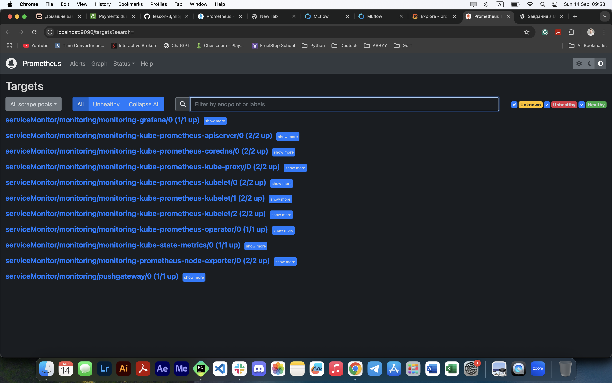
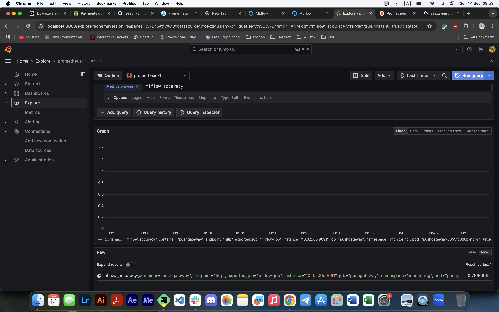
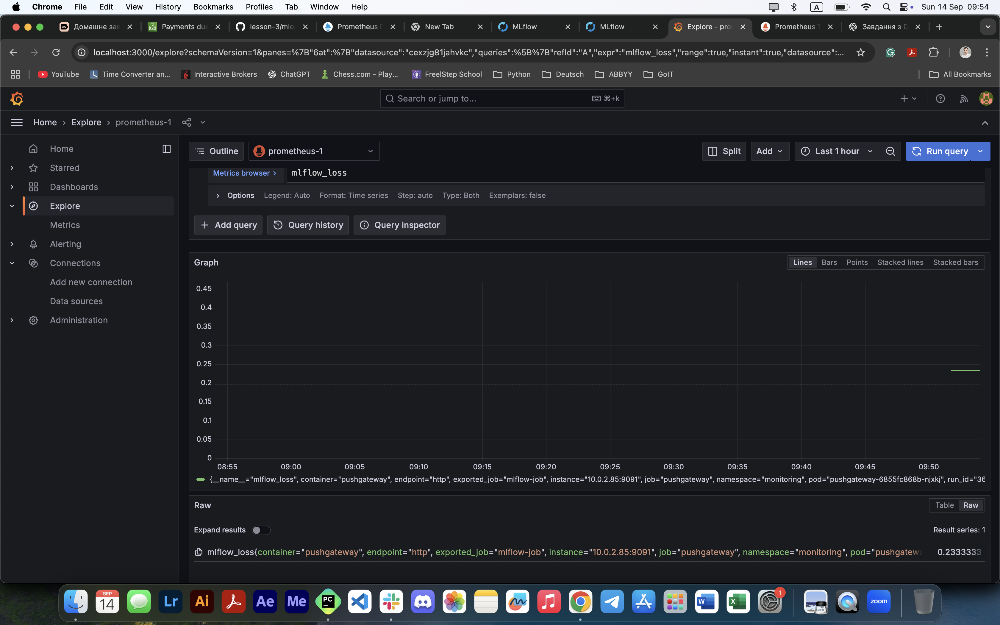
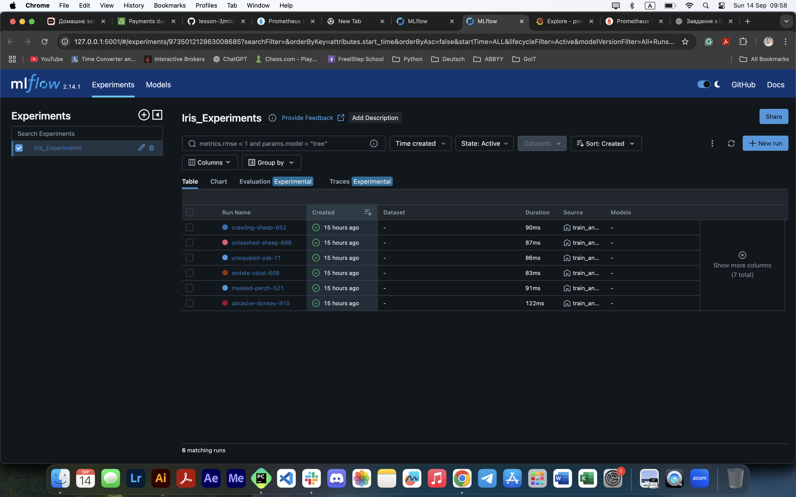
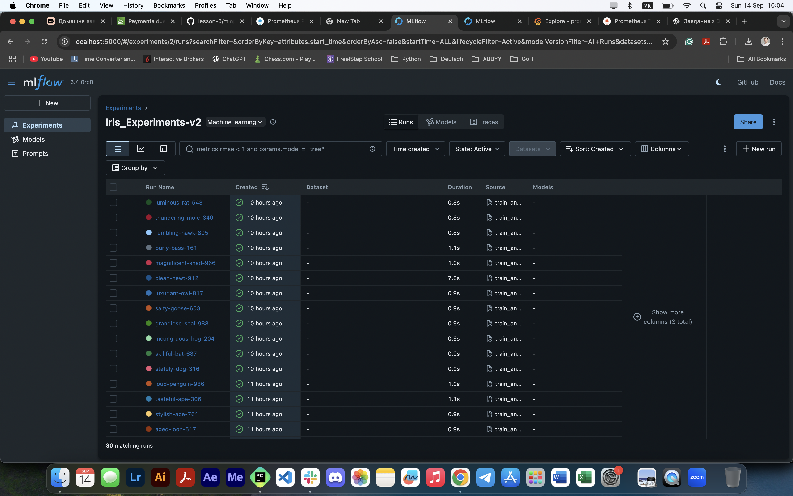

# README (Lesson 3 – MLflow + Prometheus + Pushgateway + Grafana через Argo CD)

## Зміст
1. Інфраструктура (kube-prometheus-stack, Grafana, Prometheus, Pushgateway)
2. MLflow локально
3. Скрипт тренування та пуш метрик
4. ServiceMonitor для Pushgateway
5. Як перевірити, що все працює
6. Часті граблі / нотатки
7. Screenshots

---

## 1) Інфраструктура

### 1.1 Argo CD Application для kube-prometheus-stack
Файл: `argocd/applications/monitoring.yaml`  
(приклад з уроку, з Grafana admin: `admin/prom-operator`)

Застосувати:
```bash
kubectl apply -f argocd/applications/monitoring.yaml
```

### 1.2 Важливе про сервіси kube-prometheus-stack
- Prometheus сервіс: `monitoring-kube-prometheus-prometheus` (`ClusterIP` 9090)
- Оператор: `monitoring-kube-prometheus-operator`
- Grafana сервіс: `monitoring-grafana` (`ClusterIP` 80)

Порт-форварди (у різних терміналах):
```bash
kubectl -n monitoring port-forward svc/monitoring-grafana 3000:80
kubectl -n monitoring port-forward svc/monitoring-kube-prometheus-prometheus 9090:9090
```

Grafana: http://localhost:3000 (логін/пароль: `admin` / `prom-operator`)  
Prometheus: http://localhost:9090

### 1.3 Pushgateway (через Helm chart)
Файл з аплікацією/маніфестами для Pushgateway є в `applications/pushgateway.yaml`.

Після застосування має з’явитися сервіс:
```bash
kubectl -n monitoring get svc pushgateway
# порт 9091
```

---

## 2) MLflow локально

Запустити локальний MLflow трекінг-сервер (артефакти — у робочу теку):
```bash
export MLFLOW_TRACKING_URI=http://127.0.0.1:5000
mlflow server --host 127.0.0.1 --port 5000 --backend-store-uri ./mlruns --default-artifact-root ./mlruns
```

UI: http://127.0.0.1:5000

---

## 3) Скрипт тренування та пуш метрик

Скрипт: `experiments/train_and_push.py`  
(логіка: тренує модель на Iris, логує в MLflow, пушить метрики в Pushgateway)

Важливо: встановити залежності:
```bash
pip install -r requirements.txt
# (щонайменше потрібні: mlflow, scikit-learn, prometheus-client, requests, pandas, numpy)
```

Запуск:
```bash
# якщо ти з Mac — просто
python experiments/train_and_push.py
```

Скрипт пушить дві метрики в Pushgateway:
- `mlflow_accuracy`
- `mlflow_loss`

Вони мають лейбли `job="mlflow-job"` та `run_id="<...>"`.

Швидка локальна перевірка без кластеру:
```bash
curl -s http://localhost:9091/metrics | grep mlflow_
```

---

## 4) ServiceMonitor для Pushgateway

Файл (обов’язково у **цьому шляху**):  
`argocd/manifests/monitoring-extras/pushgateway-servicemonitor.yaml`

```yaml
apiVersion: monitoring.coreos.com/v1
kind: ServiceMonitor
metadata:
  name: pushgateway
  namespace: monitoring
  labels:
    argocd.argoproj.io/instance: monitoring-extras
spec:
  namespaceSelector:
    matchNames: ["monitoring"]
  selector:
    matchLabels:
      app.kubernetes.io/instance: pushgateway
      app.kubernetes.io/name: prometheus-pushgateway
  endpoints:
    - port: http
      path: /metrics
      interval: 15s
```

Застосувати:
```bash
kubectl -n monitoring apply -f argocd/manifests/monitoring-extras/pushgateway-servicemonitor.yaml
```

Переконатися, що ресурс з’явився:
```bash
kubectl -n monitoring get servicemonitors | grep pushgateway
```

---

## 5) Як перевірити, що все працює

### 5.1 Prometheus Targets
Відкрити http://localhost:9090/targets — має бути:
```
serviceMonitor/monitoring/pushgateway/0 (1/1 up)
```

### 5.2 Grafana Explore
Відкрити Grafana → Explore → вибрати datasource **prometheus-1**  
(це той, що вказує на `http://prometheus-operated.monitoring.svc:9090`)

Запити:
- `mlflow_accuracy`
- `mlflow_loss`

Опційно відфільтрувати за label: `job="pushgateway"` або `exported_job="mlflow-job"`.

---

## 6) Часті граблі / нотатки

- **Prometheus CRD занадто великий / конфлікти CRD.** Якщо було, робимо hard refresh Application в ArgoCD:
  ```bash
  kubectl -n infra-tools patch application monitoring     --type merge     -p '{"metadata":{"annotations":{"argocd.argoproj.io/refresh":"hard"}}}'
  ```
- **Datasource “Prometheus” у Grafana зафіксований через Helm values і його не можна редагувати в UI.**  
  Створили **другий** datasource (`prometheus-1`) через `kube-prometheus-stack` — саме його використовуй в Explore.
- **ServiceMonitor селектори.** Вони мусять збігатися з лейблами `Service` Pushgateway:
  - `app.kubernetes.io/instance: pushgateway`
  - `app.kubernetes.io/name: prometheus-pushgateway`
- **Порт-форвард Prometheus** інколи “залипає” — якщо `kubectl port-forward ...` падає з timeout, спробуй ще раз або перевір, що pod `prometheus-...` у `Running`.
- **MLflow артефакти.** Якщо бачиш `Read-only file system: '/mlruns'`, це означає, що ти запускав сервер/скрипт у контейнері без RW диску. Для локального варіанту з цього README — використовуй файлову систему хоста (`./mlruns`).

---

## 6) Screenshots

### Prometheus Targets


### Grafana Accuracy


### Grafana Loss


## mlflow_UI


## mlflow_UI_2


## Готовність ДЗ

- kube-prometheus-stack розгорнуто ✅  
- Grafana доступна, є datasource на Prometheus (`prometheus-1`) ✅  
- Pushgateway розгорнуто, сервіс 9091 ✅  
- ServiceMonitor для Pushgateway підхоплений Prometheus (target **UP**) ✅  
- MLflow запущений локально, експерименти логуються ✅  
- Метрики (`mlflow_accuracy`, `mlflow_loss`) пушаться в Pushgateway і видно в Prometheus та Grafana ✅
